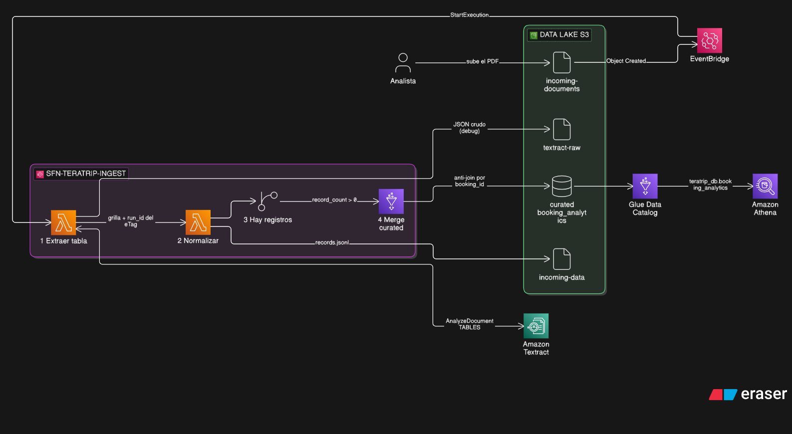
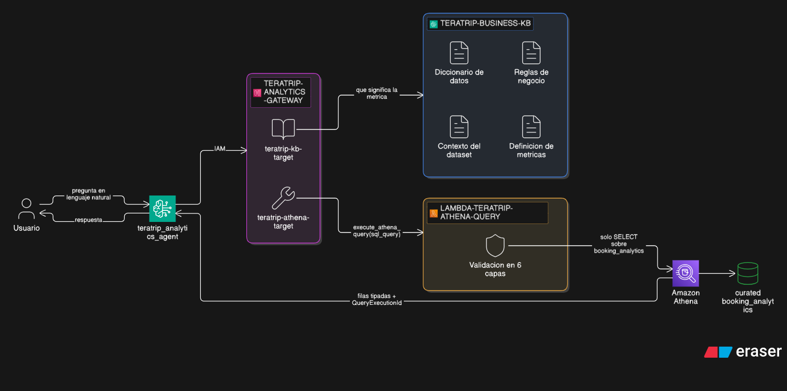

<div align="center">

# TeraTrip — Intelligent Data & Analytics

**Ingesta automática de reservas desde documentos PDF + agente conversacional sobre Athena**

Laboratorio Final · Internship Program Teracloud

[](https://aws.amazon.com/s3/)
[](src/lambdas/textract_extract/)
[](src/stepfunctions/)
[](src/lambdas/)
[](src/glue_jobs/)
[](src/queries/)
[](src/agent/)
[](src/agent/system_prompt.md)

</div>

---

Subir un PDF a S3 dispara un pipeline que extrae la tabla con **Textract**, la normaliza al esquema de
TeraTrip e incorpora los registros a la tabla sábana **sin duplicar reservas existentes**. Un agente de
**Bedrock AgentCore** traduce preguntas de negocio a SQL, las ejecuta contra **Athena** a través de una
herramienta validada, y responde citando la cifra real.

```
Usuario:  ¿Cuál es el destino con mayor revenue confirmado?
Agente:   [ teratrip-kb-target ]  →  recupera la definición de la métrica
          [ teratrip-athena-target ]  →  SELECT destination_city, SUM(confirmed_revenue) …
          «Cancún es el destino con mayor revenue confirmado, con 19.314.939,53.»
```

> [!NOTE]
> Los recursos de AWS se crean **a mano desde la consola**. Este repositorio versiona el código que los
> respalda: scripts de Glue, handlers de Lambda, la definición ASL de la Step Function, las policies IAM
> escritas a mano, los documentos de la Knowledge Base, el system prompt del agente y las pruebas.

---

## Arquitectura

### Parte A — Ingesta inteligente

<p align="center">
  
</p>

El `run_id` deriva del **eTag** del objeto, no de un UUID: si S3 emite el evento dos veces, ambas
corridas comparten prefijo y el anti-join descarta todo. El JSON crudo de Textract se guarda **antes**
de interpretarlo, que es lo que después permite distinguir *«Textract leyó mal»* de *«la normalización
rompió»*.

### Parte B — Analytics conversacional

<p align="center">
  
</p>

Los dos targets del Gateway cumplen funciones distintas: la Knowledge Base aporta **contexto de
negocio** —qué significa cada columna, cómo se calcula cada métrica— y la Lambda aporta **datos**. Los
registros de la tabla nunca se cargan en RAG.

---

## Criterios de aprobación — dónde está la evidencia

| Criterio | Implementación | Verificación |
|---|---|---|
| Un archivo nuevo en S3 inicia el flujo automáticamente | [`ingest_pipeline.asl.json`](src/stepfunctions/ingest_pipeline.asl.json) · [`eventbridge_rule_pattern.json`](src/stepfunctions/eventbridge_rule_pattern.json) | Ejecución de `sfn-teratrip-ingest` en consola |
| Textract extrae correctamente las reservas | [`textract_extract/`](src/lambdas/textract_extract/lambda_function.py) | [`test_textract_reconstruct.py`](tests/test_textract_reconstruct.py) — 6 tests |
| Los registros se incorporan **sin duplicar** | Anti-join en [`merge_curated.py`](src/glue_jobs/merge_curated.py) | Prueba 5 · log `Ya existian (descartados por anti-join): 8` |
| La tabla sábana se actualiza y Athena la devuelve | [`merge_curated.py`](src/glue_jobs/merge_curated.py) | [`01_athena_post_merge.sql`](src/queries/01_athena_post_merge.sql) — 9 consultas |
| La KB contiene contexto y reglas de negocio | [`src/kb/`](src/kb/) — 4 documentos | Prueba 2 · tasa de cancelación 15,00 % |
| El agente genera SQL válido vía herramienta | [`system_prompt.md`](src/agent/system_prompt.md) · [`tool schema`](src/agent/tool_schema_execute_athena_query.json) | Prueba 1 · las 4 preguntas al centavo |
| La Lambda **rechaza** operaciones no permitidas | 6 capas en [`athena_query/`](src/lambdas/athena_query/lambda_function.py) | [`test_sql_guard.py`](tests/test_sql_guard.py) — 34 tests |
| La traza identifica las herramientas usadas | Targets del Gateway | Traza del Harness: KB → Athena |
| La prueba end-to-end refleja el cambio | Pipeline completo | [`golden_questions.md`](tests/golden_questions.md) · ancla `Puerto Madryn` |
| Permisos IAM de **mínimo privilegio** | [`src/iam/`](src/iam/) — 7 policies | Sin `Resource: "*"` ni acciones con comodín |
| Entregable: arquitectura + problemas | [`INFORME_TECNICO_LAB3.md`](docs/INFORME_TECNICO_LAB3.md) | 10 problemas documentados + 4 preguntas de investigación |

---

## Cómo verificarlo sin credenciales

Las funciones críticas son **puras**: la reconstrucción de tablas de Textract, la normalización al
esquema y el validador de SQL no tocan AWS.

```bash
python tests/test_textract_reconstruct.py
```
```bash
python tests/test_normalize.py
```
```bash
python tests/test_sql_guard.py
```

**54 tests**, entre ellos los que cubren los casos que rompen en producción: una celda vacía que
desalinea la fila, un encabezado partido en dos líneas, `'DROP Center'` como nombre de ciudad, SQL
apilado escondido detrás de un comentario, y `ORDER BY … DESC` que una denylist ingenua rechazaría.

Para inspeccionar un JSON real descargado de `textract-raw/`:

```bash
python tests/test_textract_reconstruct.py ruta/al/archivo.json
```

---

## El dataset

Tabla sábana **`teratrip_db.booking_analytics`**: una fila por reserva, 20 columnas, Parquet sobre S3.
Combina reservas, clientes, pagos, vuelos y hoteles desnormalizados, con los campos derivados ya
calculados.

| | |
|---|---|
| Reservas | **500.008** (500.000 base + 8 ingresadas por documento) |
| Revenue confirmado | 332.793.336,98 |
| Tasa de cancelación | 15,00 % |
| Cobertura de pagos | 83,30 % |

El esquema completo, los dominios de valores y las reglas de derivación están en
[**`docs/schema_contract.md`**](docs/schema_contract.md), que es la **fuente única**: de ahí se derivan
la normalización, el merge y el diccionario de datos de la Knowledge Base. Si esos tres divergen, el
pipeline falla o —peor— castea en silencio.

---

## Estructura del repositorio

```
Laboratorio 3/
│
├── docs/
│   ├── LabFinal_TeraTrip.html ········· consigna original
│   ├── PLAN.md ······················· plan de implementación por fases
│   ├── schema_contract.md ············ contrato de esquema: 20 columnas y baseline
│   ├── INFORME_TECNICO_LAB3.md ······· entregable: arquitectura y problemas
│   └── diagrams/ ····················· fuente .eraser + export de los diagramas
│
├── src/
│   ├── glue_jobs/
│   │   ├── 00_raw_to_curated.py ······ bootstrap del dataset base
│   │   └── merge_curated.py ·········· merge incremental con anti-join
│   │
│   ├── lambdas/
│   │   ├── textract_extract/ ········· extracción y reconstrucción de la tabla
│   │   ├── normalize/ ················ mapeo al esquema de TeraTrip
│   │   └── athena_query/ ············· execute_athena_query, validación en 6 capas
│   │
│   ├── stepfunctions/ ················ ASL de la máquina de estados + EventBridge
│   ├── kb/ ··························· los 4 Markdown de la Knowledge Base
│   ├── agent/ ························ system prompt y schema de la tool
│   ├── iam/ ·························· policies inline escritas a mano
│   ├── queries/ ······················ validaciones SQL para Athena
│   ├── monitoring/ ··················· dashboard de CloudWatch y Logs Insights
│   └── pdf/ ·························· generador y documentos de prueba
│
└── tests/
    ├── test_textract_reconstruct.py ·· reconstrucción de tablas de Textract
    ├── test_normalize.py ············· normalización al esquema
    ├── test_sql_guard.py ············· validador de SQL (evidencia de la Prueba 3)
    └── golden_questions.md ··········· preguntas, SQL y resultado esperado
```

---

## Inventario de recursos de AWS

Región `us-east-1`, cuenta `955030484229`.

| Tipo | Nombre |
|---|---|
| S3 bucket | `teratrip-data-lake-955030484229` |
| Glue Database | `teratrip_db` |
| Glue Jobs | `glue-teratrip-bootstrap-curated`, `glue-teratrip-merge-curated` |
| Glue Crawler | `crawler-teratrip-curated` |
| Athena WorkGroup | `wg-teratrip` |
| Lambdas | `lambda-teratrip-textract-extract`, `lambda-teratrip-normalize`, `lambda-teratrip-athena-query` |
| Step Function | `sfn-teratrip-ingest` (Standard) |
| EventBridge rule | `evb-teratrip-new-document` |
| Knowledge Base | `teratrip-business-kb` |
| Gateway | `teratrip-analytics-gateway` (IAM / SigV4) |
| Targets | `teratrip-kb-target`, `teratrip-athena-target` |
| Harness | `teratrip_analytics_agent` (Claude Haiku 4.5) |
| CloudWatch | `dash-teratrip-lab3` + 2 alarmas |

Prefijos del bucket: `raw/`, `curated/`, `curated/_backup/`, `incoming-documents/`, `incoming-data/`,
`textract-raw/`, `kb/`, `athena-results/`.

---

<div align="center">

**Juan Ignacio Penazzi**

Laboratorio Final · Internship Program Teracloud · Data Engineering

Agosto 2026

</div>
