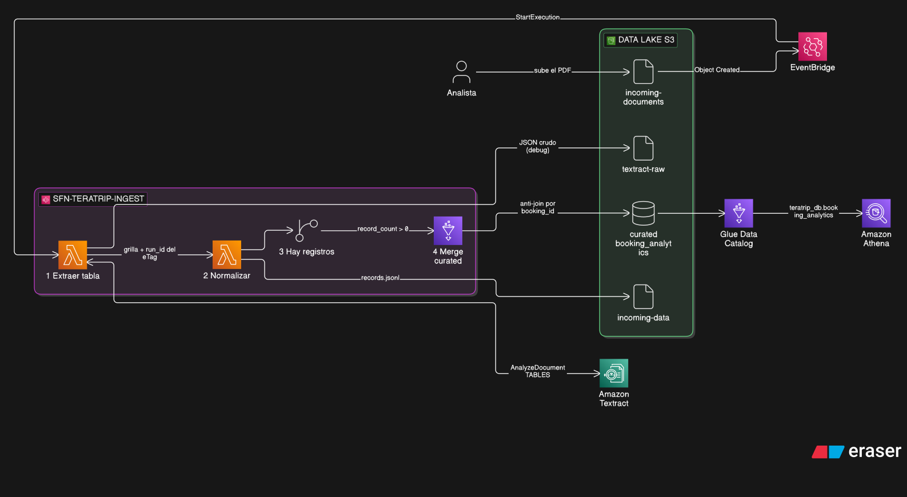
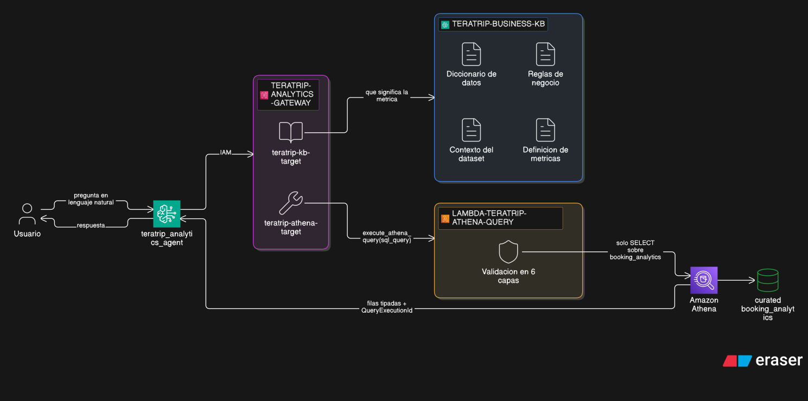

# Informe técnico — Laboratorio Final: TeraTrip Intelligent Data & Analytics

**Autor:** Juan Ignacio Penazzi · **Cuenta AWS:** 955030484229 · **Región:** us-east-1

---

## 1. Arquitectura implementada

La solución tiene dos mitades independientes que solo se encuentran en la prueba end-to-end: una
ingesta que incorpora reservas desde documentos, y un agente conversacional que consulta el dataset
resultante.

### Parte A — Ingesta inteligente de documentos



```
PDF (1 página, tabla de 6–10 reservas)
   ↓ PutObject
S3  incoming-documents/
   ↓ EventBridge  evb-teratrip-new-document   (wildcard: incoming-documents/*.pdf)
Step Functions  sfn-teratrip-ingest  (Standard)
   ├─ 1. lambda-teratrip-textract-extract   AnalyzeDocument (TABLES) → textract-raw/<run_id>.json
   ├─ 2. lambda-teratrip-normalize          esquema TeraTrip → incoming-data/<run_id>/records.jsonl
   ├─ 3. Choice: record_count > 0 ?
   └─ 4. glue-teratrip-merge-curated        (glue:startJobRun.sync) anti-join + campos derivados
   ↓
S3  curated/booking_analytics/teratrip_booking_analytics.parquet
   ↓
Glue Data Catalog → Athena  teratrip_db.booking_analytics
```

### Parte B — Analytics conversacional



```
Usuario (lenguaje natural)
   ↓
AgentCore Harness  teratrip_analytics_agent  (Claude Haiku 4.5)
   ↓ IAM / SigV4
AgentCore Gateway  teratrip-analytics-gateway
   ├─ teratrip-kb-target      → Managed Knowledge Base  teratrip-business-kb
   └─ teratrip-athena-target  → lambda-teratrip-athena-query
                                 execute_athena_query(sql_query)
                                 ↓
                               Amazon Athena (WorkGroup wg-teratrip) → booking_analytics
```

### Punto de partida reconstruido

La consigna asume que existe la tabla sábana del Laboratorio 2. Los recursos de ese laboratorio habían
sido eliminados, así que hubo que regenerarla. En lugar de reconstruir la capa operacional completa
—RDS, VPC, EC2 Bastion, conexión JDBC—, se reemplazaron los dos Glue Jobs del Lab 2 por uno solo
(`00_raw_to_curated.py`) que lee los CSV originales desde `raw/` y aplica **exactamente la misma
transformación SQL**.

El razonamiento: la capa RDS existía para *simular una fuente operacional*, no para producir el
dataset. El Lab 3 solo consume el Parquet curado. Eliminar esa capa hizo que **ningún Glue Job de este
laboratorio necesite correr dentro de una VPC** —solo hablan con S3—, lo que a su vez eliminó la VPC,
las subredes, el Internet Gateway, el Security Group con autorreferencia y el VPC Gateway Endpoint
para S3.

Baseline obtenido: **~500 mil reservas**, 0 huérfanas, 0 duplicados, validado con las 8 consultas de
`src/queries/00_athena_validation.sql` contra valores precalculados en `docs/schema_contract.md`.

### Decisiones de diseño

| Decisión | Elección | Fundamento |
|---|---|---|
| Motor del merge | **Glue (PySpark)** | Reutiliza el SQL de campos derivados ya validado en el Lab 2, de modo que un registro que entra por Textract produce exactamente los mismos campos que uno del dataset base. Con Lambda habría que reimplementar esa lógica y se abriría un riesgo permanente de divergencia. Costo: 1–2 min de arranque por corrida. |
| Formato de `incoming-data/` | **JSON Lines** | Spark lo lee con `spark.read.json` y se abre a mano desde la consola de S3 para debuggear. Parquet obligaría a empaquetar `pyarrow` como layer de la Lambda sin ganar nada a este volumen. |
| Formato de la Knowledge Base | **Markdown, un archivo por dominio** | El chunking semántico corta por encabezados, así que cada chunk recuperado llega al modelo como texto legible y autocontenido, en lugar de un fragmento estructural sin contexto. |
| Dónde vive la validación de SQL | **En la Lambda, no en el prompt** | Un prompt se sortea con una instrucción hábil; el código no. |
| Límite entre las Lambdas 1 y 2 | Textract vs. esquema de TeraTrip | La primera conoce `Blocks`, `Relationships` y `CELL`; la segunda conoce el esquema del negocio. Cambiar de motor de OCR toca un solo archivo. |
| Campos derivados | **Solo en el Glue Job** | Una única fuente de verdad. Si la normalización también los calculara, las dos implementaciones se desincronizarían. |

---

## 2. Problemas encontrados y cómo se resolvieron

### 2.1 Los PDF de ejemplo parten los encabezados en dos líneas

**Síntoma esperable:** Textract reconstruye la tabla mapeando `TABLE → CELL → WORD`. Un encabezado
partido llega como dos `WORD` en la misma celda o, peor, desalineado contra la fila de datos.

**Detección:** antes de generar el documento propio se decodificó el *content stream* de
`teratrip_reservas_ejemplo_01.pdf`. Está hecho con ReportLab, en landscape y fuente 6.1pt, y los
encabezados largos aparecen quebrados: `customer_i` + `d`, `customer_` + `country`, `payment_` +
`amount`, `payment_` + `method`.

**Solución:** el generador `src/pdf/generate_demo_pdf.py` calcula el ancho de cada columna con
`stringWidth` sobre las métricas reales de la fuente, y un `assert` falla si algún encabezado no entra
en una línea. Se verificó decodificando el PDF generado: los 12 encabezados salen como tokens enteros.

Se agregó además separación explícita entre el título, el subtítulo y la tabla: Textract agrupa por
proximidad geométrica, y dos líneas de texto muy juntas encima de una tabla pueden ser absorbidas como
una fila de encabezado espuria.

### 2.2 `sys.exit(0)` marca un Glue Job como FAILED

**Síntoma:** al probar idempotencia, el anti-join descartaba correctamente los 8 `booking_id` y la
tabla quedaba intacta, pero la Step Function terminaba en `FalloDelPipeline` con
`Error Category: SYSTEM_EXIT_ERROR; SystemExit: 0`.

**Causa:** el runner de Glue intercepta cualquier `SystemExit` y lo reporta como error, sin mirar el
código de salida. La Step Function lo veía como `States.TaskFailed` y caía al `Catch` global. Las dos
terminaciones legítimas del merge —documento sin registros, y anti-join que descarta todo— se
reportaban como fallo.

**Solución:** el cuerpo del job pasó a una función `main()` y las salidas tempranas usan `return`.
`job.commit()` quedó afuera, de modo que corre en los tres caminos. **Nunca usar `sys.exit()` en un
Glue Job.**

Se aprovechó para mover el backup del paso 2 al paso 7, justo antes de escribir: las corridas que no
incorporan nada ya no dejan copias idénticas en `curated/_backup/`.

### 2.3 En EventBridge, varios matchers sobre el mismo campo se combinan con OR

**Síntoma potencial:** el patrón inicial era
`"key": [{"prefix": "incoming-documents/"}, {"suffix": ".pdf"}]`, con la intención de exigir ambas
condiciones. EventBridge las combina con **OR**, así que la regla habría disparado con *cualquier*
`.pdf` del bucket, incluidos los de `curated/` y `textract-raw/`.

**Solución:** un único matcher `{"wildcard": "incoming-documents/*.pdf"}`.

### 2.4 Una condición `s3:prefix` rompe la verificación del bucket de Athena

**Síntoma:** `StartQueryExecution` fallaba con
`InvalidRequestException: Unable to verify/create output bucket teratrip-data-lake-955030484229`.

**Causa:** la policy de la Lambda de Athena restringía `s3:ListBucket` con una condición
`StringLike s3:prefix`. Antes de ejecutar nada, Athena verifica el bucket de salida, y esa verificación
opera a nivel **bucket**, sin prefijo: la condición nunca matchea y se deniega. Faltaba además
`s3:GetBucketLocation`.

**Solución:** `s3:ListBucket` y `s3:GetBucketLocation` sin condición sobre el bucket, manteniendo el
acceso al **contenido** acotado a dos prefijos: lectura en `curated/booking_analytics/*` y
lectura/escritura en `athena-results/*`.

Es un caso de mínimo privilegio mal aplicado: restringir por prefijo parecía más seguro, pero rompía
una llamada que el servicio hace a nivel bucket, y el mensaje de error no nombra el permiso faltante.

### 2.5 Athena devuelve los números como texto en notación científica

**Síntoma:** `SUM(confirmed_revenue)` volvía como `"1.931493953000002E7"`. Athena devuelve todo en
`VarCharValue`.

**Por qué importa:** si eso llega así al modelo, tiene que interpretarlo para responder, y ahí una
consulta correcta se convierte en una respuesta equivocada — indistinguible de un error de SQL al
debuggear.

**Solución:** la Lambda castea cada valor usando el `Type` que la propia Athena declara en
`ResultSetMetadata`, devolviendo números JSON reales y `null` donde corresponde. No se adivina el tipo
por la forma del string.

### 2.6 Falsos positivos en la denylist de SQL

**Síntoma:** los tests unitarios rechazaron
`SELECT ... ORDER BY revenue DESC`, que es lo que el agente genera en casi toda consulta de ranking.

**Causa:** `DESC` estaba en la denylist como abreviatura de `DESCRIBE`. El mismo problema tenían
`REPLACE` y `TRUNCATE`, que en Trino son **funciones escalares** además de verbos de DDL.

**Solución:** `DESC` salió de la lista —la capa que exige que la sentencia empiece con `SELECT` o
`WITH` ya impide que `DESCRIBE` llegue—, y las demás se distinguen con un lookahead de paréntesis:
`replace(...)` es una función, `CREATE OR REPLACE` es DDL.

El criterio general: **un guard que rechaza consultas legítimas es un guard que alguien termina
desactivando.**

### 2.7 El agente reutilizaba cifras ya consultadas

**Síntoma:** ante la misma pregunta repetida, el agente respondía *"acabamos de consultarlo hace poco:
hay 23.192 reservas"* sin invocar la herramienta.

**Por qué es grave:** rompe la Prueba 4, que consiste exactamente en preguntar, ingresar un documento y
volver a preguntar. La segunda respuesta habría mostrado el número viejo y la demo parecería fallada
cuando el pipeline funcionó.

**Solución:** la regla ya estaba en el system prompt, pero dentro del párrafo de "no inventes cifras".
El modelo no leyó *repetir una cifra propia* como *inventar*. Se elevó a regla propia y explícita, con
el motivo escrito: el sistema incorpora reservas de forma continua y puede hacerlo en medio de la
conversación.

### 2.8 El Harness con Memory servía datos vencidos

**Síntoma:** en una sesión nueva el agente decía *"veo en tu contexto que ya exploraste el dataset"* y
*"esto es diferente del dato que figura en tu contexto (23.192 reservas del 2026-08-25)"*. Cuando una
consulta en vivo devolvió 0, **prefirió el número recordado por encima del resultado real**.

**Solución:** se desactivó la Memory del Harness. Para este laboratorio todas las preguntas son sobre
datos que hay que consultar; recordar cifras solo sirve para entregar datos vencidos. Además hacía que
abrir una sesión limpia no fuera suficiente para aislar una prueba.

### 2.9 El modelo agrega tildes a los valores de texto

**Síntoma:** el usuario preguntó por `Cancun` sin tilde, el agente consultó `WHERE destination_city =
'Cancún'` y obtuvo **0 filas**. Afecta también a `Bogota`, `Sao Paulo`, `Cordoba`, `Asuncion`,
`Valparaiso` e `Iguazu`.

**Causa:** los valores están almacenados sin diacríticos y el modelo "corrige" la ortografía al escribir
el SQL.

**Solución:** el diccionario de datos de la KB declara la regla con una tabla de equivalencias, y el
system prompt agrega que un 0 en un filtro de texto obliga a verificar con `SELECT DISTINCT` antes de
responder. Un 0 por ortografía y un 0 real son indistinguibles para el usuario, y solo uno de los dos
es cierto.

### 2.10 La descripción de la tool hace que el modelo pre-filtre

**Observación, no defecto.** Ninguna de las entradas maliciosas de la Prueba 3 llega a la Lambda: el
modelo las rechaza antes, citando la descripción del parámetro `sql_query`, que declara que solo se
aceptan `SELECT` y `WITH` sobre `booking_analytics`.

**Decisión:** no se revierte. Sacar las restricciones de la descripción para que el modelo mande SQL
inválido empeoraría el sistema real —invocaciones desperdiciadas, latencia, peor respuesta— a cambio de
una demo más vistosa.

**Consecuencia:** la evidencia de la capa de código se obtiene por **invocación directa** de la Lambda.
Pasar por el agente solo demostraría que el guard funciona cuando el modelo colabora, que es el caso
que no preocupa: la amenaza es un modelo al que convencieron.

### 2.11 Los registros ingresados por documento quedaban sin proveedor

**Síntoma:** consultando en Athena las reservas ingresadas por documento, todas tenían `product_type`
pero `airline` y `hotel_name` en `NULL`. En las de tipo `package` faltaban **las dos**, lo que es
directamente incoherente: un paquete combina vuelo y alojamiento, así que por definición tiene ambos.

**Causa:** el diseño original asumía que el documento no podía aportar esos datos, porque no trae
`flight_id` ni `hotel_id` contra los cuales joinear. El Glue Job los escribía como
`CAST(NULL AS STRING)` y se documentó como *limitación conocida* en la Knowledge Base.

Era una limitación autoimpuesta. El documento **puede** traer el nombre de la aerolínea y del hotel
como texto; no hace falta ningún join. La supuesta limitación era en realidad un campo que nunca se
pidió.

**Regla verificada contra el dataset base**, sin una sola excepción en 500.000 filas:

| `product_type` | `flight_id` | `hotel_id` | Filas |
|---|---|---|---|
| `flight` | sí | no | 200.289 |
| `hotel` | no | sí | 149.964 |
| `package` | sí | sí | 149.747 |

**Solución**, en cuatro capas:

1. El **documento** pasa de 12 a 14 columnas, con `airline` y `hotel_name` completadas según el
   `product_type` de cada fila.
2. La **normalización** las mapea y registra un aviso en el log si falta la que corresponde. **No
   descarta la fila**: ninguno de los dos campos alimenta un campo derivado, y perder una reserva por un
   nombre de hotel ausente sería peor que dejarlo en `NULL`.
3. El **merge** impone la regla: `CASE WHEN product_type IN ('flight','package') THEN airline END`. Si
   el documento trajera una aerolínea en una reserva de tipo `hotel`, el campo se anula igual. Es el
   mismo criterio que `last_payment_method` — el merge es el único lugar donde viven las reglas de
   coherencia del esquema.
4. El **diccionario de datos de la KB** deja de declararlo como limitación y explica la regla real: un
   `NULL` en esos campos significa que el producto no incluye ese servicio, no que falte el dato.

**Efecto colateral que casi pasa desapercibido:** con 14 columnas la tabla mide 910 pt y una página A4
apaisada tiene 842. ReportLab **no avisa**: dibuja la tabla igual y las últimas columnas quedan fuera
del área visible. Textract habría devuelto una tabla incompleta y el fallo se habría descubierto recién
al mirar los datos en Athena. El generador ahora ensancha la página en lugar de achicar la fuente: el
documento se lee por OCR, no se imprime, y una fuente más chica degrada la extracción.

### 2.12 El agente generaba SQL sin consultar el diccionario de datos

**Síntoma:** ante una consulta que cruzaba varias columnas, el agente escribió el SQL directamente, sin
recuperar el diccionario de datos de la Knowledge Base para confirmar cómo se llamaba cada campo.

**Por qué importa:** el SQL se ejecuta sin error y devuelve un número. Nada falla visiblemente. Pero
mide otra cosa, y una respuesta plausible y equivocada es peor que un error, porque nadie la detecta.

**Solución:** el system prompt define ahora un **procedimiento explícito para consultas complejas** —más
de dos columnas, más de una dimensión, un `WITH`, o cualquier campo no mencionado antes en la
conversación—: consultar el diccionario y confirmar el nombre literal y el tipo de **cada** columna
involucrada, incluidas las del `WHERE`, el `GROUP BY` y el `ORDER BY`; después la definición de la
métrica si la hay; y recién entonces escribir el SQL.

Es la contracara de la instrucción original, que decía cuándo consultar la KB pero no en qué orden ni
con qué exhaustividad.

---

## 3. Preguntas de investigación

### 3.1 ¿Qué cambiarían con PDFs de decenas o cientos de páginas?

Cambian las tres capas, y ninguna es un ajuste de parámetros.

**Textract.** `AnalyzeDocument` es síncrono y está limitado a una página. Habría que migrar a
`StartDocumentAnalysis`, que es asíncrono: devuelve un `JobId`, notifica por SNS al terminar y los
resultados se recuperan paginados con `GetDocumentAnalysis`. Eso cambia el contrato de la Lambda 1 de
"llamar y devolver" a "arrancar y esperar".

**Step Functions.** La tarea de extracción deja de ser una invocación sincrónica. El patrón adecuado es
`waitForTaskToken`: la Lambda arranca el análisis con el token, y un segundo handler suscripto al SNS
llama a `SendTaskSuccess` cuando Textract termina. Alternativa más simple pero peor: un bucle
`Wait` + `Choice` poleando el estado, que consume transiciones de estado y no escala.

**El merge.** Es el cambio de fondo. Hoy es un read-modify-write sobre **un archivo único**, con
`coalesce(1)` y concurrencia limitada a 1. Con volumen alto eso se vuelve inviable: cada corrida
reescribe el dataset completo para agregar unas filas. Habría que pasar a escritura particionada —por
`booking_year` y `booking_month`, que ya son columnas— o directamente a un formato tabular con soporte
de `MERGE` real, como Iceberg. Con Iceberg el anti-join manual desaparece: se reemplaza por
`MERGE INTO ... WHEN NOT MATCHED THEN INSERT`, que además es atómico.

**El payload de la Step Function.** Hoy las filas viajan inline entre Lambdas (límite de 256 KB). Con
cientos de páginas hay que pasar solo la referencia en S3 y que cada paso lea de ahí.

### 3.2 ¿Cómo evitar procesar dos veces el mismo documento?

Con tres capas, y la clave es que **ninguna alcanza sola**. Este laboratorio implementó la primera y la
tercera; la segunda quedó documentada.

**Capa 1 — `run_id` derivado del `eTag`.** La Lambda de Textract deriva el `run_id` del `eTag` del
objeto, no de un UUID. Si S3 o EventBridge emiten el evento dos veces para el mismo archivo, ambas
corridas comparten `run_id` y escriben sobre el mismo prefijo de `incoming-data/`, en vez de generar
dos lotes distintos. *Limitación:* evita la divergencia de datos, pero no evita el reprocesamiento —
Textract y Glue se ejecutan igual.

**Capa 2 — tabla de deduplicación en DynamoDB.** Una escritura condicional con
`attribute_not_exists(etag)` al inicio del pipeline. Si el ítem ya existe, la ejecución termina sin
llamar a Textract ni levantar Glue. *Es la capa que ahorra costo.* **Limitación decisiva:** solo detecta
el **mismo archivo**. Se comprobó empíricamente: `teratrip_reservas_demo_v2.pdf` tiene los mismos 8
`booking_id` que `teratrip_reservas_demo.pdf` pero distinto contenido, por lo tanto distinto `eTag`. La
capa 2 no lo habría visto.

**Capa 3 — anti-join por `booking_id`.** Es la única que razona sobre el **dato** y no sobre el
archivo. `df_new.join(df_current, "booking_id", "left_anti")` descarta lo que ya existe, venga de donde
venga: el mismo archivo, un archivo distinto con las mismas reservas, o una carga manual. Es la que la
consigna exige y la que no se puede sacar.

Resumen: las capas 1 y 2 son optimizaciones de costo; la capa 3 es la garantía de corrección.

### 3.3 ¿Cómo validar automáticamente que la respuesta del agente coincide con Athena?

**Conjunto de preguntas golden.** `tests/golden_questions.md` mantiene cada pregunta con su SQL de
referencia y su resultado esperado al centavo. Una batería automatizada le hace las preguntas al
agente, corre el SQL de referencia de forma independiente y compara.

**Comparar contra el `QueryExecutionId`.** La Lambda devuelve el `query_execution_id` de cada consulta,
y ese ID queda en la traza. Con él se recupera de Athena el SQL exactamente ejecutado y su resultado, y
se contrasta contra la cifra que el agente citó en su respuesta. Esto detecta el caso más difícil: SQL
correcto, resultado correcto, y una síntesis equivocada en la redacción final.

**Verificaciones cruzadas de consistencia.** Independientes del valor esperado, y por lo tanto
resistentes a que los datos cambien: la suma de `confirmed_revenue` por `product_type` tiene que
igualar el `SUM(confirmed_revenue)` global; la suma de reservas por `status` tiene que dar `COUNT(*)`.
Si un desglose no cierra contra su total, el agente filtró algo de más.

**Detectar respuestas sin herramienta.** Si una pregunta que requiere datos se respondió sin invocar
`teratrip-athena-target`, la respuesta es inválida por construcción, sin importar si el número es
correcto. Es exactamente el problema 2.7.

### 3.4 Si una respuesta es incorrecta, ¿dónde está el problema?

Se aísla por capas, de adentro hacia afuera. Cada paso descarta una capa completa.

**Paso 1 — ¿el número que dijo el agente es el que devolvió Athena?** Tomar el `query_execution_id` de
la traza y mirar el resultado real. Si difiere, el problema está en la **síntesis del modelo**: el dato
llegó bien y se redactó mal.

**Paso 2 — ¿el SQL responde la pregunta que se hizo?** Leer el SQL de la traza. Si devuelve el número
que dijo pero mide otra cosa —`total_amount` en lugar de `confirmed_revenue`, `COUNT(*)` en lugar de
`COUNT(DISTINCT customer_id)`—, el problema está en el **RAG**: la KB no fue recuperada, o no es lo
bastante explícita. Se verifica en la traza si `teratrip-kb-target` fue invocado.

**Paso 3 — ¿el SQL es correcto pero el dato está mal?** Entonces el problema es de **ingesta**, y ahí
el pipeline deja rastro deliberado en tres puntos:

- `textract-raw/<run_id>.json` — el JSON crudo, guardado **antes** de interpretarlo. Permite distinguir
  "Textract leyó mal el PDF" de "la reconstrucción de la tabla rompió". La reconstrucción es una función
  pura y se puede correr en local contra ese JSON con `tests/test_textract_reconstruct.py`, sin volver a
  pagar una llamada a Textract.
- `incoming-data/<run_id>/records.jsonl` — lo que la normalización produjo.
- `incoming-data/<run_id>/_rejected.json` — las filas descartadas, cada una con su motivo y sus valores
  crudos. Ningún descarte es silencioso.

**Paso 4 — ¿los campos derivados están mal?** Los logs del Glue Job informan cuántos registros se
recibieron, cuántos se descartaron por duplicados dentro del lote y cuántos por el anti-join. Y si algo
salió mal, `curated/_backup/<timestamp>/` tiene la tabla previa al merge.

El orden importa: cada paso es más caro que el anterior, y empezar por el más barato evita revisar el
pipeline de ingesta cuando el problema era una frase mal redactada.

---

## 4. Estado de las pruebas

| # | Prueba | Resultado |
|---|---|---|
| 1 | Analytics — 4 preguntas | ✅ Las cuatro contrastadas contra Athena. Cancun 19.314.939,53 · 75.001 canceladas · revenue por producto al centavo · Argentina 12.609 clientes |
| 2 | Uso de conocimiento | ✅ Tasa de cancelación 15,00 %. El valor mismo lo prueba: con el denominador intuitivo (confirmadas + canceladas) habría dado 16,67 % |
| 3 | Seguridad | ✅ Dos capas independientes: el modelo rechaza y explica; la Lambda rechaza por invocación directa, más 34 tests unitarios |
| 4 | End-to-end | Pendiente de ejecución con `teratrip_reservas_walkthrough.pdf` |
| 5 | Idempotencia *(extra)* | ✅ Reingesta del mismo documento y de una variante con los mismos `booking_id`: el conteo no cambia |

## 5. Ciclo de vida de los objetos en S3

Cada documento procesado deja rastro en cinco prefijos, y cuatro de ellos son subproductos: existen para
diagnosticar una corrida reciente o para poder volver atrás, no para conservarse. Sin reglas de ciclo de
vida el bucket acumula indefinidamente, y el caso más notorio es `curated/_backup/`, donde **cada merge
deja una copia completa de la tabla sábana**.

| Prefijo | Qué guarda | Expira a | Fundamento |
|---|---|---|---|
| `incoming-documents/` | los PDF subidos | 30 días | Es el insumo, no el dato. El registro que produjo ya vive en la tabla, y el documento está versionado en el repositorio. |
| `incoming-data/` | JSON Lines normalizado y `_rejected.json` | 14 días | Intermedio. Su valor es diagnosticar una corrida reciente. |
| `textract-raw/` | JSON crudo de Textract | 14 días | Ídem: sirve para distinguir si falló el OCR o la normalización, y eso se hace en caliente. |
| `curated/_backup/` | copias previas a cada merge | 7 días | Recuperar una demo rota es un escenario de horas, no de meses. |
| `athena-results/` | resultados de consultas | 7 días | Regenerables: basta con volver a correr la consulta. |

`curated/booking_analytics/` **no lleva regla de expiración**: es el dato, no un subproducto. Cada regla
se acota por prefijo con la barra final incluida; una regla sobre el bucket entero, o un prefijo mal
escrito como `curated` en lugar de `curated/_backup/`, borraría la tabla sábana, y el fallo aparecería
recién cuando el merge no encontrara el Parquet.

Se agrega además una regla de alcance global para **abortar cargas multiparte incompletas a los 7 días**.
No toca ningún objeto existente: limpia fragmentos de subidas que fallaron y siguen facturando sin
aparecer en el listado del bucket.

### Por qué se descartó archivar en lugar de eliminar

Se evaluó transicionar estos objetos a clases frías —Standard-IA, Glacier, o Intelligent-Tiering con
Archive configuration— en vez de eliminarlos. **Para estos datos, archivar cuesta más que borrar.** Dos
mecánicas de facturación lo determinan:

**Duración mínima facturable.** Standard-IA factura 30 días, Glacier 90 y Deep Archive 180, aunque el
objeto se elimine antes. Mover un backup a Glacier y expirarlo a los 7 días implica pagar 90 días de
Glacier en lugar de 7 de Standard. Las clases frías asumen retención de meses; la de este pipeline se
mide en días.

**Tamaño mínimo facturable.** Standard-IA y Glacier Instant Retrieval facturan un piso de **128 KB por
objeto**. Un PDF de 4 KB pasa a costar como si pesara 128 KB, unas 30 veces más. Cuatro de los cinco
prefijos contienen archivos de pocos kilobytes.

Sobre **Intelligent-Tiering** en particular hay dos impedimentos adicionales. El primero es terminante:
los objetos de menos de 128 KB **nunca descienden de tier**, así que la mayoría de estos archivos
quedaría en el tier frecuente pagando lo mismo que en Standard, más la cuota de monitoreo. El segundo es
funcional: los tiers *Archive Access* y *Deep Archive Access* requieren un restore asincrónico de horas,
y `textract-raw/` existe precisamente para consultarse rápido cuando algo falla.

Intelligent-Tiering resuelve además un problema que este pipeline no tiene: patrones de acceso
impredecibles. Acá el patrón es conocido — estos objetos se leen una vez poco después de crearse, o no
se leen nunca. Cuando el patrón se conoce, pagar para que S3 lo descubra es costo sin contrapartida.

**Conviene ser honesto sobre la magnitud:** a esta escala el ahorro de las reglas de expiración es de
centavos. La razón real para expirar no es el costo sino la **higiene operativa** — que `curated/_backup/`
no acumule decenas de copias casi idénticas de la misma tabla y que el bucket siga siendo legible.

La decisión se daría vuelta ante un **requisito de retención**: si el PDF original tuviera que
conservarse como comprobante auditable de qué se ingresó y cuándo, `incoming-documents/` no se expiraría
sino que se transicionaría a Glacier Deep Archive con retención de años. Ahí el criterio lo fija el
cumplimiento, no el costo, y con horizontes de años los mínimos de 180 días dejan de ser un problema.
Los otros cuatro prefijos no admiten ese argumento: son subproductos regenerables.

---

## 6. Observación sobre mínimo privilegio

Las policies escritas a mano para este laboratorio —Lambdas, Glue, Step Functions, EventBridge— están
acotadas por recurso y por prefijo, sin `Resource: "*"` ni acciones con comodín. La única excepción es
`textract:AnalyzeDocument`, que no admite permisos a nivel de recurso: no existe un ARN de documento
contra el cual acotar.

En cambio, las policies que la consola genera automáticamente al crear el rol de ejecución del AgentCore
Gateway sí incluyen `Resource: "*"` en dos statements (`bedrock:AgenticRetrieveStream` y
`bedrock:Rerank`). Se dejaron sin modificar: son el default del servicio y alterarlas puede romper la
recuperación. Queda asentado como observación consciente, no como omisión.
